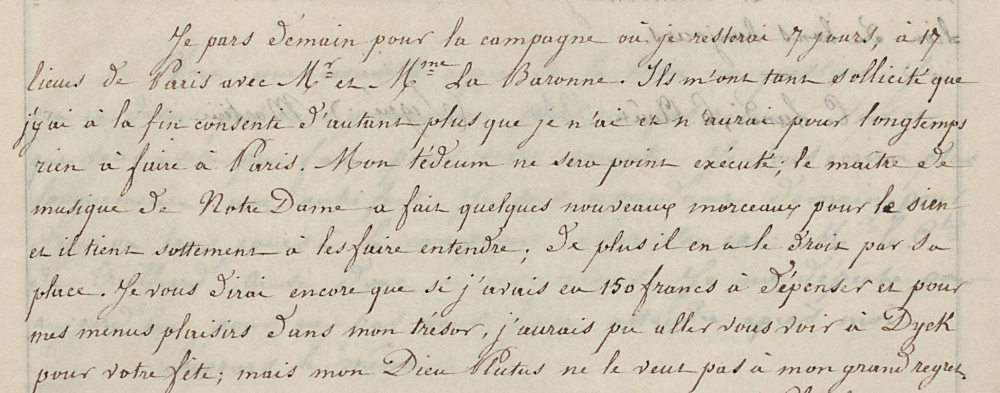

Sources
=== 
Ce dossier est destiné au test et à l'entraînement des modèles de reconnaissance d'écriture.

Il contient notamment :
- La table d'identification des mains : [mains.csv](./mains.csv)
- Le journal comptabilisant les scores d'acuité des entraînements de modèles : [journal-rec.json](./journal-rec.json)
- La liste des modèles de reconnaissance d'écriture : [modeles-rec/](./modeles-rec/)

Les mains sur lesquels on procède actuellement à l'entraînement des modèles sont listées ci-dessous.

# mainCdS02_Konv002_01
Il s'agit de la main principale de la série de recueils intitulée "2e copie", voir en particulier le [2e vol.](https://constance-de-salm.de/archiv/#/document/11216) et le [3e vol.](https://constance-de-salm.de/archiv/#/document/11217)

# mainCdS02_Konv019_01
Il s'agit de la main attestée au début du recueil de la correspondance adressée par [J.P.E. Martini](https://viaf.org/viaf/19866122/) à Constance de Salm.

# mainCdS02_Konv019_02
Il s'agit de la seconde main attestée dans la correspondance adressée par [J.P.E. Martini](https://viaf.org/viaf/19866122/) à Constance de Salm.

